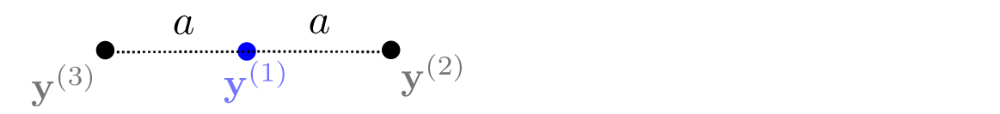

# Stochastic neighbor embedding (SNE) 

There are topics and exercises.

## Key Ideas 

* Probabilistic approach to place objects from high-dimensional space into low-dimensional space so as to preserve the identity of neighbors.
* Center a Gaussian on each object in high-dimensional space
* Find embedding so that resulting high-dimensional distribution is approximated well by resulting low-dimensional distribution
* Determine low-dimensional distribution by minimizing Kullback-Leibler (KL) divergence.
* SNE is a non-convex optimization problem and it is optimized using gradient descent from an initial configuration. There are many local optima and it does depend on the initialization.

## (Symmetric) SNE

* In **high dimensional space**, given dissimilarity / distance matrix $D_{ij}$ of data in a $p$-dimensional space
  $$
  D_{ij}^2 = \|\mathbf{x}^{(i)} - \mathbf{x}^{(j)}\|^2 \qquad i \neq j
  $$

  For each data point $x^{(i)}$, define the probability of picking another data point $x^{(j)}$ as its neighbor to be
  $$
  p_{ij} = \frac{exp(-D^2_{ij})}{\sum_{k \neq l} exp(-D^2_{kl})}
  $$
  where the denominator sums over all distinct pairs of data points with indices $i < j$ since $p_{ij} = p_{ji}$.

  The set of $p_{ij}$ defines the **PMF of probability distribution** $\mathbf{P}$ on all pairs of points in $p$-dimensional space. The shape of the Gaussian distribution ensures that pairs that are close together are given much more weight than pairs that are far apart.

* In **low dimensional space**, for each point $y_i$, we define the probability of picking $y_j$ as its neighbor to be 
  $$
  q_{ij} = \frac{exp(-\|y_i - y_j\|^2_2)}{\sum_{k \neq l}exp(-\|y_k - y_l\|^2_2)} \qquad i \neq j
  $$
  The set of all $q_{ij}$ define the **PMF of a probability distribution** $\mathbf{Q}$ on all pairs of points in the $q$-dimensional target space.

* **Minimization**: We want to find points $y_i$ in low dimensional space ($q$-dimensional space) and place them in such as way that the distribution of them in KL divergence is as close as possible to the distribution in the high dimensional space. In other words, we want to minimize the KL-divergence between the probability distributions $\mathbf{P}$ and $\mathbf{Q}$:
  $$
  KL(P||Q) = \sum_{i \neq j} p_{ij} \log \frac{p_{ij}}{q_{ij}}
  $$

  * The term $p_{ij}\log \frac{p_{ij}}{q_{ij}}$ is zero if $q_{ij}=p_{ij}$, negative if $q_{ij}<p_{ij}$, positive if $q_{ij}>p_{ij}$.
  * When $D_{ij}$ is small, $p_{ij}$ is large. If $q_{ij}$ is small, then KL divergence is large.
  * When $D_{ij}$ is large, $p_{ij}$ is small. If $q_{ij}$ is large, then KL divergence is negative. 
  * However, it is not always the case that large $D_{ij}$ will be replaced by small distances in a lower dimensional space, because we could replace a small $p_{ij}$ by a large $q_{ij}$ with only limited times, and at some point we have to replace a large $p_{ij}$ by a small $q_{ij}$. 
  * Also since we multiply $p_{ij}$ which is a very small portion, by modeling $p_{ij}$ by $q_{ij} = p_{ij} + x$ we gain less than we lose by choosing $q_{ij} = p_{ij}-x$.

  This minimization is implemented using **gradient descent methods**. Therefore, KL divergence keeps nearby objects nearby and separated objects relatively far away. 

Note that in the definition of the distributions $\mathbf{P}$ and $\mathbf{Q}$, we have used **Gaussian** distributions with the **same variance** at each data point which simplified the definition of $p_{ij}$ and $q_{ij}$. Practical algorithms are more sophisticated: they use Gaussian distributions with different variances $\sigma_i^2$ at different data points, and then symmetrize between points $i$ and $j$ to get the PMF $p_{ij}$, which is known as t-SNE.

## tSNE

* Problem of SNE: sometimes crowding points that should be far away because there is much less space in the low dimensional space. So medium-distance points might actually become closeby points.

* t-SNE reduces this by using t-distribution with 1 degree of freedom for $y$'s.
  $$
  q_{ij} = \frac{(1 + \|y_i - y_j\|^2_2)^{-1}}{\sum_{k \neq l}(1 + \|y_k - y_l\|^2_2)^{-1}}
  $$
  Compared to Gaussian distribution, t-distribution has fatter tails. This property allows moving points that are at a medium distance even farther away does not matter anymore (probabilities are the same).

## KL-Divergence (Recap)

Let $\mathbf{P}$ and $\mathbf{Q}$ be discrete probability distributions with common sample space and with PMFs $p$ and $q$ respectively. Then the **KL-divergence** (also known as **relative entropy** ) of $\mathbf{P}$ from $\mathbf{Q}$ is defined as
$$
\text {KL}(\mathbf{P}, \mathbf{Q}) = \sum _{x \in E} p(x) \ln \left( \frac{p(x)}{q(x)} \right)
$$
Two useful properties of distances:

* Non-negative: $\text {KL}(\mathbf{P}, \mathbf{Q})\geq 0$
* Definiteness: If $\text {KL}(\mathbf{P}, \mathbf{Q})=0$, then $\mathbf{P}=\mathbf{Q}$.

Two different properties from distances:

* Asymmetry: $\text {KL}(\mathbf{P}, \mathbf{Q})\neq \text {KL}(\mathbf{Q}, \mathbf{P})$.
* No triangle inequality: $\text {KL}(\mathbf{P}, \mathbf{Q})\nleq \text {KL}(\mathbf{P}, \mathbf r)+\text {KL}(\mathbf r, \mathbf{Q})$.

> #### Exercise 19
>
> Define $\mathbf{D}$ using Gaussian on each point in the target 1-dimensional space 
> $$
> q_{ij}=\frac{\exp (-d_{ij}^2)}{\sum _{k>l}\exp (-d_{lk}^2)}\qquad (i<j)
> $$
> where $d_{ij}$ is the distance between the points $\mathbf{y}^{(i)}$ and $\mathbf{y}^{(j)}$ in 1-dimension.
>
> Let the embedding into 1 dimension of the 3 given points in 2 dimensions look like the configuration below
>
> 
>
> Find the distribution $\mathbf{Q}$. That is, find $q_{12} = q_{13}$ and $q_{23}$ in terms of $y = e^{-a^2}$ and $\delta = e^{-(2a)^2}$.
>
> > **Answer**:  $q_{12}=q_{13} = \frac{y}{\delta + 2 \times y}, \quad q_{23} = \frac{\delta}{\delta + 2 \times y}$.
>
> Now fix the distances between the nodes in high dimension to be $A = 1$ and $B = \sqrt{2}$.
>
> 
>
> Find the probability distribution $\mathbf{Q}$ in 1-dimension that minimizes the KL-divergence
> $$
> \text {KL}(\mathbf{P}||\mathbf{Q})=p_{12}\ln \frac{p_{12}}{q_{12}}+p_{13}\ln \frac{p_{13}}{q_{13}}+p_{23}\ln \frac{p_{23}}{q_{23}}.
> $$
>
> > **Answer**: when $a = 0.577$.
>
> > **Solution**:  
> >
> > From PMFs of the previous questions we know that $q_{ij}$ depends only on $y=e^{-a^2},\,$ where $a$ is the unknown distance in 1 dimension between the central node and either boundary node. Thus, **the question of finding distribution $\mathbf{Q}$ that minimizes the KL-divergence is equivalent to finding the distance $a$ that minimizes** $KL(\mathbf{P}||\mathbf{Q})$.
> >
> > So we solve $KL(\mathbf{P}||\mathbf{Q}) = 0$. Since $p_{12}=p_{13}$ and $q_{12}=q_{13}$, 
> > $$
> > \begin{aligned}
> > \text{} p_{12}&=q_{12}\\
> >  \frac{x}{\epsilon +2x} &= \frac{y}{\delta + 2y}\\
> >  \frac{\delta}{y} &= \frac{\epsilon}{x}\\
> > \end{aligned}
> > $$
> > For SNE, $\delta =\exp (-(2a)^2)=y^4$. Plugging in $\delta$ gives
> > $$
> > \begin{aligned}
> > y &= \left(\frac{\epsilon }{x}\right)^{1/3}\qquad (x=e^{-A^2},\epsilon =e^{-B^2}) \,\\
> > e^{-a^2} &= e^{-(B^2-A^2)/3}\\
> > a &= \pm \sqrt{(B^2-A^2)/3}.
> > \end{aligned}
> > $$
> > Given $A = 1, B = \sqrt{2}$, we get $a = 1/\sqrt{3} \approx 0.577$.

Generalize the configuration to $p$ dimensions so that there is 1 central node and $p$ boundary nodes, with boundary nodes all at distance $A$ from the center node and a larger distance $B(B > A)$ from each other. The term in the KL-Divergence $KL(\mathbf{P} || \mathbf{Q})$ can be separated into two groups, those that involve the central node $\mathbf{x}^{(1)}$ and a boundary node, and those that involve two boundary nodes.
$$
\begin{aligned}
\text {KL}(\mathbf{P}||\mathbf{Q}) &= \sum _{i< j} p_{ij}\log \frac{p_{ij}}{q_{ij}}\\
 &=\sum _{j=1}^{p} p_{{\color{blue}{1}} j}\log \frac{p_{{\color{blue}{1}} j}}{q_{{\color{blue}{1}} j}}+ \sum _{i\neq 1} \sum _{j} \mathbf{P}_{ij}\log \frac{p_{ij}}{q_{ij}}
 \end{aligned}
$$
If the dimension $p$ becomes large, there are many more terms in the second group, then when minimizing the KL-divergence, it becomes more important to choose large $q_{ij}$ so that $p_{ij}<q_{ij}$. This means **shortening the distance between the boundary nodes in the low-dimensional target space** is weighted more heavily, and the boundary nodes are crowded together in the target space.