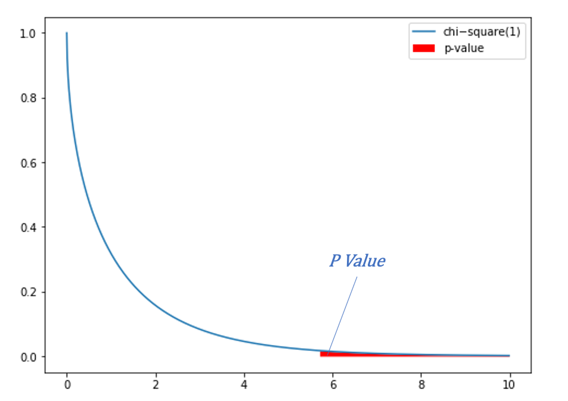
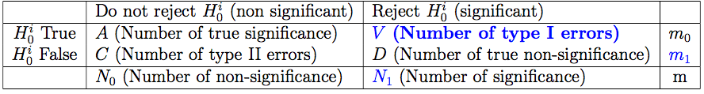

# Likelihood Ratio Test and Multiple Hypothesis Testing

There are 4 topics and 6 exercise.

## 1. Likelihood Ratio Test

**Model**: $X \sim p(x, \theta)$, parametric model with parameter $\theta$.

**Test**: $H_0: \theta \in \Theta_0$ versus $H_A: \theta \in \Theta_A$, where $\Theta_0$ and $\Theta_A$ are disjoint subsets: $\Theta_0 \cap \Theta_A = \emptyset$ of a parameter space $\Theta = \Theta_0 \cup \Theta_A$.

**Likelihood ratio**: $L(x) = \frac{max_{\theta \in \Theta_0} p(x;\theta)}{max_{\theta \in \Theta} p(x;\theta)}$, where $\Theta = \Theta_0 \cup \Theta_A$.

* $p(x;\theta)$ is the probability / density of observing the data $x$.
* the parameter $\hat{\theta}$ that maximizes $p(x;\theta)$ is called the **maximum likelihood estimator (MLE)**.
* $0 \leq L(x) \leq 1$ since
  * the numerator: MLE of $\theta$ is selected from a range of $\theta$ from null model
  * the denominator: MLE of $\theta$ is selected from a wider range of $\theta$ from the union of null model and alternative model.
* The likelihood ratio test statistic is a valid statistic for the hypothesis test. It can distinguish between the null hypothesis and the alternative.
  * $L(x)<< 1$ if $\theta \in \Theta_A$ [ so when the likelihood is too small, we would like to reject the null hypothesis ]
  * $L(x) \approx 1$ if $\theta \in \Theta_0$

**Likelihood ratio test**: Reject $H_0$ if $L(x) < \eta$, where $\eta$ is chosen such that $P_{H_0}(L(x) \leq \eta) = \alpha$. This means that we choose the cutoff value $\eta$ so that the probability of rejecting the null when the null is true (Type I error) is equal to $\alpha$.

* **Neyman-Pearson Lemma**: Likelihood ratio test is the most powerful among all level $\alpha$ tests for testing $H_0: \theta = \theta_0$ versus $H_A: \theta = \theta_A$. Among all tests testing the same simple hypothesis and at the same significance level, the likelihood ratio test gives the largest probability of rejecting the null when indeed the alternate is true.

## 2. Asymptotic Likelihood Ratio Test

In general $L(x)$ does not have an easily computable null distribution, i.e. it is difficult to determine $\eta$. So we defined $\Lambda(x)$ as (negative twice) the logarithm of the likelihood ratio $L(x)$.

**Likelihood ratio statistic**:
$$
\Lambda(x) = -2log(L(x)) = -2log\frac{\max_{\theta \in \Theta_0}p(x;\theta)}{\max_{\theta \in \Theta}p(x;\theta)}
$$

* $0 \leq \Lambda(x) \leq \infty$

* reject $H_0$ if $\Lambda(x)$ is too large

Equivalently, in **MLE**
$$
L(x) = \frac{ p\left(x;\hat{\theta }_{\text {MLE}}^{\text {constrained}}\right)}{p\left(x;\hat{\theta }_{\text {MLE}}\right)}
$$
where $\hat{\theta}_{MLE}$ is the maximum likelihood estimator of $\theta$ and $\hat{\theta}^{constrained}_{MLE}$ is the constrained maximum likelihood estimator of $\theta$ within $\Theta_0$.

> #### Exercise 2: 
>
> In HIP mammography study data, 31000 people are in treatment group, out of which 39 were died from breast cancer. 31000 people are in control group, out or which 63 were died from breast cancer.  We use binomial model for $Y_T$ and $Y_C$:
> $$
> Y_ T\sim \text {Binom}(31000, \pi _ T)\\
> Y_ C\sim \text {Binom}(31000, \pi _ C)
> $$
> Give the expression of the likelihood ratio test statistic and find all the MLE $(\pi_T, \pi_C)$ in the expression.
>
> > **Answer**:  
> >
> > $\Lambda(y_T, y_C) = -2\log \frac{\mathbf{P}\left(\text {Binom}(31000,{{\hat{\pi }^{\text {MLE}}}} ) = y_ T\right)\mathbf{P}\left(\text {Binom}(31000,{{\hat{\pi }^{\text {MLE}}}} ) = y_ C\right) }{\mathbf{P}\left(\text {Binom}(31000,{{\hat{\pi }^{\text {MLE}}_ T}} ) = y_ T\right)\mathbf{P}\left(\text {Binom}(31000,{{\hat{\pi }^{\text {MLE}}_ C}} ) = y_ C\right)} \\ {{\hat{\pi }^{\text {MLE}}}} = (39+63)/(31000*2);\\ {{\hat{\pi_T }^{\text {MLE}}}} = 39/31000; \\ {{\hat{\pi_C }^{\text {MLE}}}} = 63/31000$.
>
> > **Solution**: 
> >
> > These three MLEs are the parameter of the binomial distribution $Binom(62000, \pi), Binom(31000, \pi_T), Binom(31000, \pi_C)$, respectively.

> #### Review: MLE for Binomial Distribution
>
> **PMF** of the binomial distribution $Binom(n,p)$,
> $$
> \mathbf{P}(k; n, p) = \binom {n}{k} \cdot p^ k \cdot (1-p)^{n-k}
> $$
> To find the MLE for the binomial distribution, first take the **logarithm** of the likelihood:
> $$
> \begin{aligned}
> \ln [\mathbf{P}(p; n, k)] & = \ln {[\binom {n}{k} \cdot p^ k \cdot (1-p)^{n-k}]}\\
> & = \ln {\binom {n}{k}} + \ln {p^ k} + \ln {(1-p)^{n-k}}
> \end{aligned}
> $$
> Then, find $p$ where the **derivative** of $P(p;n,k)$ is zero:
> $$
> \frac{\partial \ln {[\mathbf{P}(p; n, k)]}}{\partial p} = 0 + \frac{k}{p} - \frac{n-k}{1-p} = 0
> $$
> Hence, the **MLE** is $p = \frac{k}{n}$.

## 3. Distribution of Likelihood Ratio Test Statistics

**Wilks Theorem**:  when the sample size is large, the distribution of $\Lambda$ under $H_0$ approaches a $\chi^2$ distribution with $d$ degrees of freedom.
$$
\Lambda(x) \overset {n\to \infty }{\longrightarrow } \chi _ d^2, \text{ where } d = dim(\Theta) - dim(\Theta_0) > 0
$$
When we have degree of freedom $d$ and $\Lambda$, we can compute p-value using python code `chi2.sd(lambda, d)` since the distribution of $\Lambda$ and p-value is 

> #### Exercise 3:
>
> Determine the degree of freedom $d$ for the following models:
> $$
> H_0: \pi_{treatment} = \pi_{control};\\ H_A: \pi_{treatment} \neq \pi_{control}
> $$
>
> > **Answer**:  $d = 1$
>
> > **Solution**: The $dim(H_0) = 1, dim(H_A) = 2$, since in a plane where $y = \pi_{treatment}, x = \pi_{control}$, $H_0$ is a line ($y = x$), while $H_A$ is anywhere else.

## 4. Metrics for false significance

When testing **one** hypothesis, to control **false discovery**, we set a **significance level** $\alpha = P(\text{reject } H_0 | H_0 \text{ is true })$ to be a small value such as 0.05.

When performing **multiple** hypothesis tests, we use two **protection levels** to control false significance: 

* **Family-wise error rate (FWER)** $\leq \alpha$ , where
  $$
  \begin{aligned}
  FWER & = P(\text{at least one false significant result}) \\
  & = p(V \geq 1) \\
  & = 1- p(V = 0)\\
  \end{aligned}
  $$
  where (number of type I errors) ${V} =\sum _{i=1}^{m_0} \Psi _ i$ , $\{\Psi _ i\}$ is the set of $m_0$ tests for which $H_0$ is true. 

  * **Bonferroni correction**: to bound FWER.

    Reject $H_0$ when $m \cdot p\text{-value} \leq \alpha$ or p-value is bounded by $ p^{i}< \frac{\alpha }{m}$ ( i.e. significance level is set to be $\alpha/m$ ) , where $m$ is the total number of hypothesis tests performed. 

    Bonferroni correction implies FWER $\leq \alpha$. 
    $$
    \begin{aligned}
    P(V \geq 1) & =  P(V = 1) + P(V = 2) + ... + P(V = m_0)\\
    & \leq 0 \cdot P(V = 0) + 1 \cdot P(V = 1) + 2 \cdot P(V = 2) + ... + m_0 \cdot P(V = m_0)\\
    & = \mathbf E(V) ~~~~~~~~~~~~~[\text{ assume tests were ind. and } V \sim Binomial(m_0, \frac{\alpha}{m})]\\
    & = m_0 \cdot \frac{\alpha}{m} \\
    & \leq \alpha
    \end{aligned}
    $$
    In fact $\mathbf E[V]=m_0 \left(\frac{\alpha }{m}\right)$ holds even when tests are not independent ( **there is no additional assumption** ), 
  $$
    \begin{aligned}
  P(V \geq 1) & = \mathbf{P}(\cup _{i\in \mathcal{I}_0}\{ \Psi _ i=1\} ) \\
    & \leq \sum _{i\in \mathcal{I}_0} \mathbf{P}(\Psi _ i=1) =\sum _{i\in \mathcal{I}_0} \frac{\alpha }{m} = {\color{blue}{m_0}} \frac{\alpha }{m}\leq \alpha
  \end{aligned}
  $$
  where $\Psi _ i$ is the indicator variable, with $\mathbf{P}(\Psi _ i=1)= \frac{\alpha }{m}$, thus $\Psi _ i=1$ means $H_0^i$ is rejected; $\mathcal{I}_0=\{ i=1\ldots m| H_0^ i \, \text {true}\}$ is the set of all indices $i$ such that test $i$ has a true null hypothesis $H_0^i$. $\mathcal{I}_0$ is of size $m_0$.
  
  However, large number of tests may lead to low power of tests. 
  
  * **Holm-Bonferroni correction**: higher power than Bonferroni correction
  
    Sort p-values in increasing order: $p_{(1)} \leq ... \leq p_{(m)}$.
  
    Reject $H_0$ when $(m-i+1)p_{(0)} \leq \alpha$. (more powerful than Bonferroni).
  
    Holm-Bonferroni correction implies FWER $\leq \alpha$.
  
* **False discovery rate (FDR)** $\leq \alpha$, where
  $$
  \begin{aligned}
  FDR & = \text{expected fraction of false significant results among all significant results}\\
  & = \mathbb {E}[\frac{V}{N_1}]
  \end{aligned}
  $$

  * **Benjamini-Hochberg correction**: just get the protection of the false discovery rate

    Sort p-values in increasing order: $p_{(1)} \leq ... \leq p_{(m)}$.

    Reject $H_0$ when: $mp_{(i)} \leq \alpha$, i.e. reject all of $H_0^{(1)}, H_0^{(2)}\cdots , H_0^{(k)}$ when find the maximum $k$ such that 
    $$
    {p^{(k)}\leq \frac{k}{m}\alpha }
    $$
    Benjamini-Hochberg correction implies FDR $\leq \alpha$ for  a series of $m$ **independent** tests.

> #### Exercise 4
>
> The paired test in which treatment effects are measured on 100 variables for 1000 people, if we perform $m$ independent tests each at significant level $α$, then the FWER is
>
> > **Answer**:  $\text {FWER} = \mathbf{P}(V\geq 1) = 1-\mathbf{P}(V=0)= 1 -(1- \alpha )^ m \approx 1 \qquad \text {for large } m.$
>
> > **Solution**:  This shows that **if we set the significance level of each test without taking into account the large number of tests performed, it is highly likely that the series of tests will lead to at least one false discovery**. The consequence is more false significance results. This is why for multiple hypothesis tests, setting the significance level for all tests to be some fixed $α$ (independent of the number of tests) may not be enough to control false significance.

> #### Exercise 5
>
> If a hypothesis $H^i_0$ is rejected by the Bonferroni correction, it is also rejected by the Holm-Bonferroni correction.
>
> A. True
>
> B. False
>
> > **Answer**: A
>
> > **Solution**: When $H_0^i$ is rejected by the Bonferroni correction, it means that $mp_i \leq \alpha$, which implies $(m-i+1)p_i \leq \alpha$ for $i$ since $(m-i+1) \leq m$ . It follows that $(m-i+1)p_i \leq \alpha$ for any $j < i$ and $p_ j\leq p_ i$. Therefore, $H_0^1,\cdots , H_0^ i$ are all rejected by Holm-Bonferroni correction.

Commonly accepted practice: 

* FDR $\leq 10\%$ in exploratory analysis or screening
* FWER $\leq 5\%$ in confirmatory analysis

#### Proof: FDR has **higher power** than FWER, equivalently, FWER is **stricter** than FDR. 

Consider an extreme scenario, where all null hypothesis are true, thus any rejected null hypothesis must be falsely rejected. In this case $V = N_1$, if any null hypothesis were rejected, then $V/N_1 = 1$, if none was rejected, then $V/N_1 = 0$.

If one or more null were rejected, then
$$
 \mathbb {E}\left[\frac{V}{N_1}\right] = \mathbf{P}(V \geq 1)\\
 \text{FDR} = \text{FWER}
$$
Now let's consider the general case where there are some false null hypotheses, thus $V \leq N_1$.Define an indicator variable $1(V \geq 1)$ which takes value 1 when $V \geq 1$. Then
$$
\begin{aligned}
\frac{V}{N_1} & \leq 1(V \geq 1) \text{ when } V \geq 1 \\
\frac{V}{N_1} & = 1(V \geq 1) = 0 \text{ when } V = 1 \\
\end{aligned}
$$
Taking expectation on both sides we get
$$
\begin{aligned}
\mathbb {E}\left[\frac{V}{N_1}\right] & \leq \mathbf E[\mathbf{1}(V\geq 1)] =\mathbf{P}(V \geq 1) \\
\text{FDR} & \leq \text{FWER}
\end{aligned}
$$
**Since FDR is less than FWER, it is easier to control than FWER. That is, we do need to apply as large a correction factor for the FDR than we do to the FWER to get it under our significance threshold $α$. Therefore, the power of a series of tests with FDR controlled will be larger that the power of the series with FWER controlled.**

> #### Exercise 6
>
> 1. When generating hypotheses, how should we process p-values? 
> 2. For food and drug administration, where efficacy standards are strict, how should we process p-values?
> 3. For doing exploratory analysis or screening, where test many hypothesis as part of one large scale study, how should we process p-values?
>
> A. No correction, report the original p-values
>
> B. FDR $\leq 10\%$
>
> C. FWER $\leq 5%$
>
> > **Answer**: 1A, 2C, 3B
>
> > **Solution**: 
> >
> > 2C. When approving pharmaceuticals, we do not wish to tolerate even a single false positive. A false positive could result in a patient being given a treatment that does not work, when there are other drugs available that are effective.
> >
> > 3B. If the number of hypotheses is very large, the FWER correction factor will be extremely strict, as it controls for even one false positive. In comparison, as the FDR is based on a ratio, and so it scales with the number of hypotheses performed. We will also get proportionately more false positives, but this is acceptable as such errors will be corrected by further studies (such as clinical trials).

