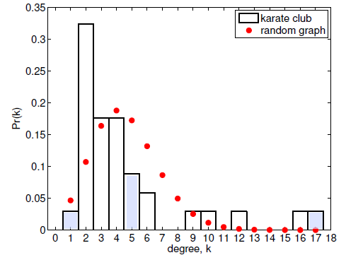

# Graphical Models

There are 5 topics.

## 1. Erdos-Renyi model

$G(n,p)$, where each edge between the $n$ nodes is formed with probability $p \in [0,1]$ independently of every other edge.

* Expected number of edges: $\mathbb{E}[\text{number of edges}] = {n \choose 2} p$

* Expected degree of a node: $\mathbb{E}[k_i] = (n-1)p$

* Degree distribution is $\text{Binomial} (n-1,p)$

  $\mathbb{P}(k) = {n-1 \choose k} p^k (1-p)^{n-1-k}$

* Degree distribution does not follow a power law

  approximation of binomial distribution by **Poisson distribution**
  $$
  \mathbb{P}(k) = \frac{e^{-\lambda}\lambda^k}{k!} \quad \text{where } \lambda = (n-1)p\\
  \log \mathbb{P}(k) = -\lambda + k \log(\lambda) - \log(k!) \approx - k \log (k) - k + k \log(\lambda)  \approx - k \log(k)
  $$
  **Power law degree distribution**
  $$
  \log \mathbb{P}(k) \approx - \lambda \log(k)
  $$
  The **exponent** of the power law degree distribution is always between 2 and 3 no matter what kind of network it is.

* The average **geodesic** does scale logarithmically with the number of nodes (not linearly).
* **Small-world** property, for a constant degree $c$, one can show that **diameter** is $\log(c)$.
* **Locally tree-like**, i.e. few triangles

* Problems:

  * In binomial distribution $\log \mathbb{P}(k) \approx - k \log(k)$ just dies off very quickly compared to power law degree distribution, so we have too few high-degree nodes, which is in fact not the case in reality, so this model does not fit the data well.

    

  * Clustering coefficient (which is the fraction of triangles among all connected triples) is 
    $$
    p \approx {c \over n} \quad \text{where c is mean degree, n is |nodes|}
    $$
    which is small and sparse, but in reality the coefficient is usually quite larger.

## 2. Configuration model

**Configuration model** generates random networks with a **given degree distribution** (e.g. power law), and addresses unrealistic degree distribution of Erdos-Renyi graphs.

* Specify degree sequence ($k_1, ..., k_n$) and attach $k_i$ stubs to node $i$.
* Choose 2 stubs at random and create edge connecting them and continue process with remaining stubs.
* Drawbacks
  * it's possible to have self-loops and multi-edges
  * clustering coefficient is of order of $1/n$ which is too small.

## 3. Preferential attachment model

**Preferential attachment model** is a **generative network model**. It explores hypothesized generative mechanisms to see what structures they produce.

* In context of bibliographic network: newly appearing paper cites previous ones with probability proportional to their number of citations. Give every paper $\beta$ citations for free.

* This model has **power law degree distribution**: $p_k \sim k^{-\alpha},$ where $\alpha = 1 + \frac{\beta}{c}$.

* Drawbacks
  * leads to acyclic network
  * small clustering coefficient

## 4. Small-world model

Generate **circulant graph**, where every node around a cycle is connected to its $c$ closest neighbors.

* Drawback: Diameter is of order $n$, no power law degree distribution.

**Small-world model**

* rewire edges at random with probability $p$
* leads to networks with high clustering coefficient and small diameter
* Drawback: degree distribution does not follow power law

## 5. Summary

Features of those models: 

* Erdos-Renyi model

  Realistic diameter, but small clustering coefficient and binomial degree distribution.

* Configuration model

  Power law degree distribution, realistic diameter, but small clustering coefficient.

* Preferential attachment model

  Generative model with power law degree distribution, realistic diameter, but small clustering coefficient.

* Small-world model

  Generative model with high clustering coefficient, realistic diameter, but no power law degree distribution.

We want to have a power law degree distribution, a high clustering coefficient, and a small diameter in these networks. But none of these models that satisfy all those properties. To have all three properties, we may want to combine them in some nice ways.